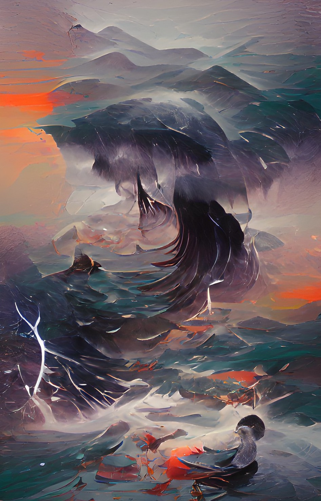

# Hello!
{: .display-4}
 
You have found Iris' homepage. It is probably not up to date, but maybe you can find something useful here anyway.
{: .welcomefont}

Iris works as a project scientist in the [Sauter group]() at [Lawrence Berkeley National Laboratory](). He is focusing on two main projects right now, the [(sp)ectral (re)solution of (a)nomalous (d)ispersion (SPREAD)]() project and the [(exa)scale computing for X-ray (f)ree (e)lectron (l)aser diffraction experiments (ExaFEL)]() project. Essentially, these involve the development of new computational capabilities to meet instrumental demands such as the megahertz pulse rate of LCLS II and to leverage the awesome potential of these experiments.
{: .welcomefont}

Outside of the lab (and inside too), Iris is a coffee afficionado, student of various languages, avid reader, and companion to a very affectionate cat named Rory. When he has time he also enjoys aikido, pottery, cooking, and hiking. He is queer/trans/nonbinary and uses pronouns he/him, she/her, or they/them.

Iris is reachable at [irisdyoung@gmail.com](mailto:irisdyoung@gmail.com). He is also active on [twitter](http://twitter.com/irisdyoung) and has some work on up [github](http://github.com/irisdyoung). Feature requests, bug reports, requests for troubleshooting help, wild ideas, and general inquiries welcome!

 

{:style="max-height: 200px; width:auto;"}

{:style="max-height: 200px; height:auto;"}

_Fact: Iris is 70% coffee by volume._
