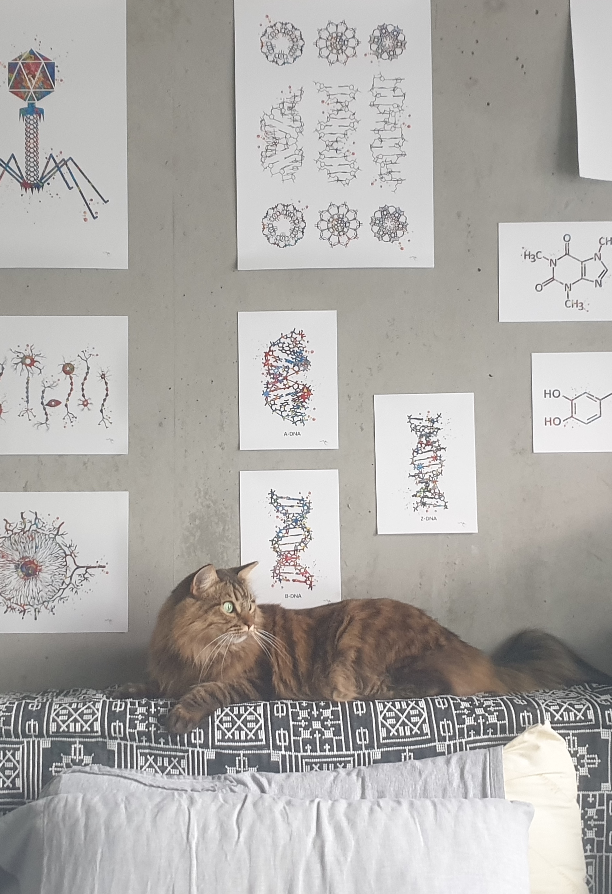

{: .display-4}
 

{:style="width: auto; max-width: 90%; margin:0"}

Hello! You have found Iris' homepage. He is currently working as a postdoc researcher in the Pearson group at the [Hamburg Advanced Research Centre for Bioorganic Chemistry (HARBOR)](https://www.cui.uni-hamburg.de/en/harbor.html), part of the University of Hamburg and located in the DESY campus. His main project is developing data acquisition and data processing software for serial electron crystallography. Serial crystallography, using either an electron or an X-ray beam, enables observation of biological structures at discrete time points in a process. A series of structures recovered in this manner can provide mechanistic insights into how they carry out their biological functions. The challenge of serial methods is that each crystal yields only one diffraction pattern, and various assumptions from rotation crystallography about the relationships between adjacent images in an image set are broken. While serial crystallography itself is not a new technique, its applications in time-resolved experiments in structural biology are relatively recent and require adaptations to existing computational methods.
{: .welcomefont}

Before moving to Hamburg, Iris worked as a project scientist in the [Sauter group](https://biosciences.lbl.gov/profiles/nicholas-sauter/) at [Lawrence Berkeley National Laboratory](https://www.lbl.gov/) on the [(exa)scale computing for X-ray (f)ree (e)lectron (l)aser diffraction experiments (ExaFEL)](https://www.exascaleproject.org/research-project/exafel/) project, bringing our XFEL crystallography data processing tools to the exascale regime. As the world's five instruments capable of these experiments undergo upgrades to enable kHz or MHz image acquisition rates, we are preparing to be able to process these datasets in real time and provide the feedback necessary to drive these experiments. Our code is all open source and is available on github: the [cctbx_project](https://github.com/cctbx/cctbx_project) and [dials](https://github.com/dials/dials) repos make up the core of the codebase, while our scripts and notes for the ExaFEL project are available in the [exafel_project](https://github.com/ExaFEL/exafel_project) repo. Some side projects like the [diffraction simulation viewer](https://github.com/dermen/sim_erice) have their own homes as well.

{: .welcomefont}

Outside of the lab, Iris is a coffee afficionado, student of various languages, and companion to a very affectionate cat named Rory. When he has time he also enjoys electronics, fixing stuff, 3d printing, sewing, reading, aikido, pottery, cooking, baking, bicycling and walking. He is queer/trans/nonbinary and uses pronouns he/him, they/them or she/her.

Iris is reachable at [irisdyoung@gmail.com](mailto:irisdyoung@gmail.com). He is also active on the fediverse via <a rel="me" href="https://neuromatch.social/@iris">mastodon</a> and has some work on up [github](http://github.com/irisdyoung). Publications including associated links and full text pdfs are available on the [publications](https://irisdyoung.github.io/publications/) tab, and should also be associated with his [ORCID](https://orcid.org/0000-0003-4713-9504) record.

_Fact: Iris is 70% coffee by volume._
{: .welcomefont}

